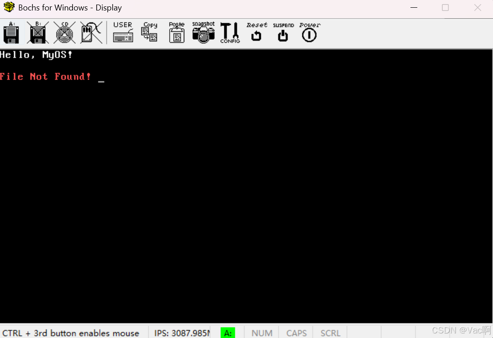

# 本节背景
计算机开机启动后，位于**ROM**中的**BIOS**即开始**上电自检**，这个过程BIOS会检测硬件设备是否存在问题。如果检测无误的话，将根据BIOS的启动项配置选择引导设备。
 
当检测到所选的引导设备的第一个扇区以被称为**魔法数**（0x55和0xaa）的两个字节结尾时，BIOS即认为该扇区是一个**引导扇区**（boot sector)，则该引导设备是**可引导的**（bootable)。

随即BIOS将此扇区的数据复制到物理内存地址**0x7c00**处，随后将处理器的执行权移交给这段程序（跳转至0x7c00地址处执行），此即为第一次控制权转移。

用于引导内核启动的程序叫做**引导程序**（bootloader)，引导程序需要完成引导扇区自启动、文件系统识别、硬件检测、处理器模式切换、页表配置等工作，并最终将控制权交给系统内核。

由于引导扇区被限制为一个扇区大小（**512B**），而对于现代操作系统的引导程序（需要设置显示模式、切换处理器模式及设置页表等）来说显然不够，因此将引导程序**分为两段**是现代操作系统开发中更常见的做法。

将引导程序分为两级后，**一级引导程序boot**用于寻找并加载二级引导程序进内存，并将控制权转移给二级引导程序；而**二级引导程序loader**则用于实现引导程序的主要任务，并加载内核程序进入内存，最终实现控制权转移给内核程序。
# 本节目的
- 完成**一级引导程序boot.asm**的编写，并在其中实现**FAT12文件系统**。
- 制作**操作系统（启动）盘**。
- 进行第一次**虚拟机启动**。
# 实现
首先对一些常量进行定义，并规定程序**起始地址**。
（此部分只面向汇编器，汇编后不占用任何存储空间，）
```x86asm
; boot.asm

BaseOfBoot       equ  0       ; 一级引导程序加载地址基址(实际地址乘以16)
OffsetOfBoot     equ  0x7c00  ; boot将被BIOS加载到07c00
BaseOfTemp       equ  0       ; 临时缓冲区段基址, 用于存储读取到的根目录、FAT表
OffsetOfTempRoot equ  0x7e00  ; 临时缓冲区根目录偏移地址
OffsetOfTempFAT  equ  0x8000  ; 临时缓冲区FAT表偏移地址
BaseOfLoader     equ  0x1000  ; loader加载地址基址(实际地址乘以16)
OffsetOfLoader   equ  0       ; loader加载地址偏移

org 0x7c00
```
## FAT12
对于加载Loader程序，最理想的方法自然是从**文件系统**中把Loader程序加载到内存里。考虑到代码的易实现性，本操作系统将选用逻辑简单的**FAT12**文件系统来装载Loader程序和内核程序。

要将系统盘格式化为FAT12文件系统，需要在引导程序的开头使用FAT12文件系统结构，这样的引导扇区被称为**FAT12文件系统引导扇区结构**，包括跳转指令（3B）、FAT12格式信息（59B）、引导代码（448B）及结束标志魔法数（2B），共计**512B**。(关于FAT12的相关补充知识见文章末尾）
```x86asm
	; FAT12格式
    jmp short Start
    nop
    BS_OEMName db "MyOSboot" ; OEM标识, 生产厂商标识, 8字节补齐
    BPB_BytesPerSec dw 512 ; 每个扇区(sector)大小, 固定为512B
    BPB_SecPerClus db 1 ; 每簇(cluster)扇区数, 由于扇区容量较小会导致软盘读取次数过于频繁, 因此FAT文件系统中以簇而不是扇区为存储单位, 必须为2的幂次方
    BPB_RsvdSecCnt dw 1 ; 保留扇区数, 起始于第一个扇区，此值不能为0, 这里数量为1则FAT表从第二个扇区开始
    BPB_NumFATs db 2 ; FAT表数，通常为2, FAT表2是FAT表1的备份表, 二者完全相同
    BPB_RootEntCnt dw 224 ; 根目录可容纳的目录项数，对于FAT12而言，该数乘32必须是每扇区大小512的偶数倍, 共14个扇区
    BPB_TotSec16 dw 2880 ; 扇区总数，软盘容量为1.44MB, 1.44MB/512B=2880。总扇区依次包括保留扇区、FAT表扇区、根目录扇区和数据区扇区
    BPB_Media db 0xf0 ; 介质描述符, 对于不可移动的存储介质而言, 标准值是0xF8; 对于可移动的存储介质, 常用值为0xF0
    BPB_FATSz16 dw 9 ; 每个FAT表占用的扇区数
    BPB_SecPerTrk dw 18 ; 每磁道扇区数
    BPB_NumHeads dw 2 ; 磁头数
    BPB_HiddSec dd 0 ; 隐藏扇区数, 用于引导扇区的前面
    BPB_TotSec32 dd 0 ; 如果BPB_TotSec16为0, 则使用这个字段记录扇区总数
    BS_DrvNum db 0 ; int 13h的驱动器号
    BS_Reserved1 db 0 ; 保留
    BS_BootSig db 0x29 ; 扩展引导标记, 0x29表示FAT12
    BS_VolID dd 0 ; 卷序列号
    BS_VolLab db "MyOSBOOT   " ; 指定卷标, 它就是Windows或Linux系统中显示的磁盘名, 11字节补齐
    BS_FilSysType db "FAT12   " ; 文件系统类型, 这个类型值只是一个字符串而已，操作系统并不使用该字段来鉴别FAT类文件系统的类型, 8字节补齐
```

## start
在程序的起始部分立即对部分寄存器进行初始化，由于**代码段寄存器**`cs`已经在控制权进行转移时被赋值，且其他段寄存器我们尚且用不到，因此这里只对**数据段寄存器中的**`ds`、**栈段寄存器**`ss`以及**栈指针寄存器**`sp`进行赋值(关于寄存器的相关补充知识见文章末尾）。

完成寄存器的初始化后即调用**BIOS中断**进行清屏操作并显示启动字符串信息。(关于BIOS中断相关补充知识自行搜索）

最后就是boot程序的主要任务——搜索二级引导程序loader。
```x86asm
start:
	; 段寄存器不能直接赋值，需要通过通用寄存器间接赋值
    mov ax, 0
    mov ds, ax
    mov ss, ax
    mov sp, 0x7c00

    ; 清屏
    mov ax, 0x0600
    mov bx, 0x0700
    mov cx, 0
    mov dx, 0x0184f
    int 0x10

    ; 显示字符串
    mov si, 0           ; 信息类型
    mov bp, BootMsg     ; 字符串地址
    mov ax, BaseOfBoot  ; 段地址
    mov es, ax
    call Func_ShowMsg   ; 调用显示信息函数

    ; 搜索loader.bin文件
    mov dx, 0               ; 记录已搜索的根目录扇区数
```
## 搜索loader.bin
这里我们使用三层循环在根目录扇区对loader.bin文件名进行搜索。
```x86asm
LoadRootDirSec:
    ; 第一层循环, 读取根目录扇区
    cmp dx, RootDirSecNum   ; 与总根目录扇区数比较
    je FileNotFound         ; 如果已搜索完所有根目录扇区说明不存在
    mov ax, BaseOfTemp
    mov es, ax              ; 传递缓冲区段地址
    mov bx, OffsetOfTempRoot; 传递缓冲区根目录的偏移地址
    mov ax, RootDirSecStart ; 传递读取扇区号
    add ax, dx              ; 计算当前根目录扇区号
    inc dx                  ; 已搜索的根目录扇区数加1
    call Func_ReadOneSec    ; 调用读取扇区函数
    mov bx, 0               ; 记录已读取的目录项数大小(B)
SearchRootDirSec:
    ; 第二层循环, 在根目录扇区中搜索目录项
    cmp bx, [BPB_BytesPerSec]; 如果已读取的目录项数大小(B)等于扇区大小(512B)则说明该扇区已读取完毕
    je LoadRootDirSec        ; 则继续读取下一个扇区, 否则继续在当前扇区中搜索文件名
    mov si, LoaderName       ; 待比较文件名偏移地址
    mov di, OffsetOfTempRoot ; 待比较根目录开始地址
    add di, bx               ; 计算当前根目录项偏移地址
    dec di                   ; 避免下面的CmpFileName中inc di第一次多加一个1
    add bx, RootDirEntSize   ; 每次增加目录项大小32字节
    mov cx, 0                ; 记录已比较的文件名字节数
    cld                      ; clear direction flag, 清除方向标志(DF)将其设置为0, DF决定了字符串操作指令(如MOVS, CMPS, SCAS, LODS, 和STOS)在处理内存时的方向。
CmpFileName:
    ; 第三层循环, 按字节比较文件名
    cmp cx, 11               ; 文件名长度为11
    je FileFound             ; 如果全部11个字节比较完毕则说明找到文件
    inc cx
    inc di
    lodsb                    ; 从[ds:si]指向的内存单元读取待搜索文件名的一个字节到al, si自动增加(需要设置DF=0)
    cmp al, byte [es:di]     ; 与根目录项中的文件名字段比较
    je CmpFileName           ; 如果相等则继续比较下一个字节
    jmp SearchRootDirSec     ; 否则继续比较下一个根目录项
```
## 文件未找到
如果未找到loader文件，则显示错误信息。

```x86asm
FileNotFound:
    mov si, 1
    mov bp, FileNotFoundMsg
    mov ax, BaseOfBoot
    mov es, ax
    call Func_ShowMsg
```
## 加载loader
如果找到，则加载loader进入内存。

根据根目录项中得到的文件起始簇号在FAT表及数据区依次读取进loader.bin文件中的所有内容至物理地址**0x10000**（自己规定）处。

```x86asm
FileFound:
    and di, 0xffe0           ; 获取文件目录项的起始地址
    add di, 0x1a             ; 加上文件起始簇号字段的偏移地址
    mov ax, BaseOfTemp
    mov es, ax
    mov si, [es:di]          ; 获取文件的起始簇号(2B)
    mov bx, OffsetOfTempFAT  ; 传递缓冲区FAT表的偏移地址
    mov ax, FAT1SecStart     ; 传递FAT表1起始扇区号
    mov cx, 0                ; 记录已读取的FAT扇区数
LoadFAT:
    ; 读取全部FAT表进内存
    call Func_ReadOneSec     ; 调用读取扇区函数
    inc ax                   ; 计算下一个FAT扇区号
    inc cx                   ; 已读取的FAT扇区数加1
    add bx, [BPB_BytesPerSec]; 缓冲区偏移地址加上扇区大小(512B)
    cmp cx, FAT1SecNum       ; 与总FAT扇区数比较
    jne LoadFAT              ; 如果未读取完所有FAT扇区则继续读取
    mov bx, OffsetOfLoader   ; 传递Loader加载地址偏移地址
LoadFile:
    ; 根据簇号加载文件
    and si, 0xfff            ; 只取低12位, 即簇号(1.5B)
    cmp si, 0xff8            ; 如果簇号大于等于0xff8则是当前最后一个簇
    jae Loader               ; 则跳转到Loader
    mov ax, BaseOfLoader
    mov es, ax               ; 传递Loader加载地址段地址
    mov ax, DataClusSecStart ; 数据区起始扇区号
    sub ax, 2                ; 减去前两个FAT保留项, 即实际数据区起始簇是从第3个簇(2号)开始          
    add ax, si               ; 传递实际扇区号
    call Func_ReadOneSec
    add bx, [BPB_BytesPerSec]; 缓冲区偏移地址加上扇区大小(512B)
    ; 获取下一个簇号值
    mov ax, si               
    and si, 1                ; 保存簇号的奇偶性
    shr ax, 1                ; 除以2后剩下的就是表项偏移
    mov cx, 3                ; 乘以3字节/2簇
    mul cx                   ; 默认操作数是ax
    mov di, OffsetOfTempFAT  ; 获取FAT表起始地址
    add di, ax               ; 计算表项偏移地址
    add di, si               ; 计算奇偶偏移地址
    mov ax, BaseOfTemp
    mov es, ax               ; FAT表段基址
    mov dx, word [es:di]     ; 读FAT表项值(2B)
    shl si, 2                ; 根据奇偶性确定加下来要取高12位还是低12位
    mov cx, si               ; shr的第二个操作数必须是立即数或CL寄存器
    shr dx, cl               ; 右移4/0位, 即取高/低12位
    mov si, dx               ; 更新簇号值
    jmp LoadFile             ; 继续加载文件的下一个簇
```
## 跳转至loader
在将loader加载进内存后即可进行跳转，将控制权交给loader去完成引导程序的余下工作。

```x86asm
Loader:
    ; 跳转到Loader
    jmp BaseOfLoader:OffsetOfLoader     ; 这里会把BaseOfLoader赋值给CS, OffsetOfLoader赋值给IP 
```
## 函数实现
对上述代码中出现的函数进行实现：
### 读磁盘扇区函数

```x86asm
; 读磁盘扇区(1个)函数
; es传递缓冲区段地址
; bx传递缓冲区偏移地址
; ax传递读取扇区号(LBA)
Func_ReadOneSec:
    ; LBA格式转换为CHS格式
    push cx
    push dx
    push si
    mov cl, byte [BPB_SecPerTrk] ; 每磁道扇区数
    div cl                  ; div指令的被除数是默认的, 不能指定; 当除数是8位时, 被除数是ax, 商在al, 余数在ah
    inc ah                  ; 转换为CHS格式, 扇区号从1而不是0开始
    mov cl, ah              ; cl存放扇区号
    mov dh, al              ; dh存放磁头号
    and dh, 1               ; 转换为CHS格式, 磁头号为0或1
    shr al, 1               ; 转换为CHS格式, 商除以2结果为柱面号
    mov ch, al              ; ch存放柱面号
    mov si, 0               ; 记录重试次数
Retry:
    ; 读取磁盘/失败重读
    mov ax, 0               ; 重置驱动器
    mov dl, [BS_DrvNum]     ; dl存放驱动器号
    int 0x13                ; 0x13中断0x00功能号为复位磁盘
    mov ah, 0x02            ; ah存放功能号, 0x02为读磁盘
    mov al, 1               ; al存放读取扇区数
    int 0x13                ; 调用BIOS中断13h读取磁盘, 返回值放在FLAGS寄存器的CF位
    jnc Return              ; 如果CF=0则读取成功, 否则重试
    add si, 1               ; 重试次数加1
    cmp si, 3               ; 最多尝试3次
    jne Retry               ; 重试
    mov si, 1               ; 否则显示错误信息
    mov bp, ReadSecErrorMsg
    mov ax, BaseOfBoot
    mov es, ax
    call Func_ShowMsg
Return:
    pop si
    pop dx
    pop cx
    ret
```
### 消息显示函数

```x86asm
; 显示信息函数
; si传递信息类型(0x00:显示并返回, 0x01:错误)
; es传递错误信息段地址
; bp传递错误信息偏移地址
Func_ShowMsg:
    push ax
    push bx
    push cx
    push dx
    mov cx, 0               ; 字符串长度
Count:
    ; 循环计算字符串长度
    mov bx, bp
    add bx, cx
    inc cx
    mov al, [es:bx]
    cmp al, 0
    jne Count
    mov ax, 0x1301          ; 显示字符串
    mov dh, [Row]           ; 行号
    mov dl, 0               ; 列号
    mov bl, dh
    add bl, 2               ; 每次隔两行
    mov [Row], bl           ; 更新行号
    cmp si, 0
    jne HALT
Fin:
    mov bx, 0x000f          ; 页号为0，颜色为15
    int 0x10
    pop dx
    pop cx
    pop bx
    pop ax
    ret
HALT:
    mov bx, 0x008c           ; 红色闪烁效果
    int 0x10
    hlt
    jmp HALT
```
## 余下数据内容
将全局变量及消息数据等放在代码段（虽然这里并未明确区分）后面。

```x86asm
Msg:
    Row       db 0
    BootMsg:  db "Hello, MyOS!", 0
    ReadSecErrorMsg: db "Read Disk Error!", 0
    LoaderName: db "LOADER  BIN", 0
    FileNotFoundMsg: db "File Not Found!", 0
```
## 魔法数
在扇区的最后放置**引导扇区标志**。

```x86asm
	times 510-($-$$) db 0
    db 0x55, 0xaa        ; 魔法数
```
至此，**boot.asm**的全部内容已经完成。
# 成果
首先使用**Linux**的**dd命令**创建一个**空的虚拟软盘镜像文件**bootloader.img（也可以使用bochs自带的**bximage命令**创建）：

```bash
> dd if=/dev/zero of=bootloader.img bs=512 count=2880
```
接着使用**nasm**汇编器对boot.asm进行汇编，得到**二进制程序文件**boot.bin：
```bash
> nasm boot.asm -o boot.bin
```
得到的boot.bin文件大小应该恰好是**512B**，并且使用**十六进制阅读器**会发现其中的最后两个字节为**0x55**和**0xaa**。

汇编结束后，便可将生成的**二进制程序文件**写入（而不是复制）到虚拟软盘镜像文件内。

由于此时还不存在文件管理系统，因此只能使用**dd命令**把引导程序强制**写入**到虚拟软盘的固定扇区中（而**复制**一词则涉及到文件系统的操作，是后续**装载**loader和kernel的流程）。
```bash
> dd if=boot.bin of=bootloader.img conv=notrunc
```
最后即可在**bochs虚拟机**中启动该虚拟软盘镜像查看效果：
- 如果是在Linux的命令行中直接运行`bochs`命令，则选择其中的`begin simulation`后再选择刚刚创建的镜像文件进行模拟。
- 如果是Windows的图像化bochs窗口，则在`Edit Options`栏中选择`Disk & Boot`进行输入镜像文件配置，配置好后即可点击`Start`开始模拟。
- 这里我们使用统一的终端命令，首先**找到/生成/创建/编写**自己的**bochs配置文件**(形如bochsrc.bxrc，类似文件即可，完全可以直接copy。），然后运行：

```bash
bochs -f bochsrc.bxrc
```
- **注**：**bochs.bxrc**是你自己的bochs配置文件，里面包含了运行系统环境、虚拟软盘镜像文件等信息，实在找不到也不会创建可以自行上网搜。但上述所有的方案基本配置都应类似于：**floppya: type=1_44**, 1_44=".\bootloader.img", **status=inserted**, write_protected=0。

虚拟机运行结果如图：


由于此时还没有编写并装载loader程序进虚拟软盘，因此会显示`File Not Found!`错误信息，但其中的`Hello, MyOS!`则表明我们已经成功运行了我们的一级引导程序！

完结撒花 !!!

# 总结
- **完成了一级引导程序的编写**
- **实现FAT12文件系统格式化**
- **完成了系统启动盘的制作**
- **成功利用bochs虚拟机对虚拟软盘镜像进行模拟，并成功运行**

# 补充
## FAT(File Allocation Table)文件分配表
 - FAT文件系统以**簇**为单位来分配数据区的存储空间（扇区），数据区的簇号与FAT表的表项是一一对应关系。即使文件的长度只有一个字节，FAT也会为它分配一个簇的磁盘存储空间。
 - **FAT文件系统的结构**是由**引导扇区**、**FAT表**、**根目录区**、**数据区**组成
 - FAT表中的**表项位宽**与FAT类型有关，例如，FAT12文件系统的表项位宽为12 bit、FAT16文件系统的表项位宽为16 bit、FAT32文件系统的表项位宽为32 bit。
 - 由于FAT12的表项位宽为12位, 故**两个表项共用3个字节**, 且数据是有交叉的，第二个字节的高4位是下个簇号的低4位, 第二个字节的低4位是上个簇号的高4位
 - FAT的前两个表项FAT[0]和FAT[1]是**保留表项**，索引值从0开始, FAT表项值具有一下含义:
   - 0x000: 可用簇
   - 0x002~0xfef: 已用簇, 值表示文件下一个簇的簇号
   - 0xff0~0xff6: 保留簇
   - 0xff7: 坏簇
   - 0xff8~0xfff: 表明这是文件的最后一个簇
- **根目录项**是一个由32B组成的结构体，其中记录着文件名字（8B文件名+3B拓展名，共11B）、文件长度以及数据起始簇号等信息

## 寄存器

- `X`表示**16位拓展**, `H`表示高8位, `L`表示低8位, 前缀`E`表示**32位寄存器**, `R`表示**64位寄存器**
- 虽然`AX`等可以作为通用寄存器, 在特定用途下使用时会被编译为不同长度的指令, 如`add`指令与`AX`寄存器搭配时会被编译为3字节码, 而与`CX`搭配时则会被编译为4字节码命令
- 只有`BX`、`BP`、`SI`、`DI`可以作为间接寻址的**基址寄存器**, 而`AX`、`CX`、`DX`、`SP`则不能
- 通用寄存器:
  - `AX` 累加寄存器
  - `BX` 基址寄存器
  - `CX` 计数寄存器
  - `DX` 数据寄存器
- 段寄存器: 
段寄存器出现的原因在于8086中CPU的数据总线(即ALU算数逻辑单元)宽度为16位, 但地址总线宽度为20位, 为了能够访问1MB的内存空间, 采用了**段地址+偏移地址**的方式, 通过段寄存器存储段地址, 通过偏移地址存储偏移地址。
不论指定什么内存地址, 使用的都是`段:基址`的方式。在**实模式**下表示**段址*16+基址**, 16对应4位二进制数(1位16进制数)，即在16位模式下最多进行1MB(实际为1114095, 略大于1M)寻址。而在**保护模式**或**长模式**下段寄存器中存储的则是**段选择子**。 若`[]`中未指定段寄存器, 则默认为`DS`。
  - `CS` 代码段寄存器, 与ip搭配使用, 作为代码段的段基址。取值时, 通过CS:IP的值(实际为段寄存器缓存区中的基地址base+ip)来确定下一条指令的地址, 然后ip+所读取的指令长度, 从而指向下一条指令, 然后重复上述过程
  - `DS` 数据段寄存器, 一般与bx、bp、si、di或立即数搭配使用, 作为数据段的段基址
  - `SS` 栈段寄存器, 与sp搭配使用, 作为栈段的段基址
  - `ES` 拓展段寄存器, 作为辅助段寄存器, 当前程序使用附加数据段的段基址，该段是串操作指令中目的串所在的段
  - `FS` 标志段寄存器, 80386起增加的两个辅助段寄存器之一,在这之前只有一个辅助段寄存器ES, 指向当前活动线程的TEB结构(线程结构)
  - `GS` 全局段寄存器, 80386起增加的两个辅助段寄存器之一
- `BP` 基址指针寄存器
- `IP` 指令指针寄存器
- `SP` 栈指针寄存器
- `SI` 源变址寄存器
- `DI` 目的变址寄存器
- `CR0~4` 控制寄存器0~4
